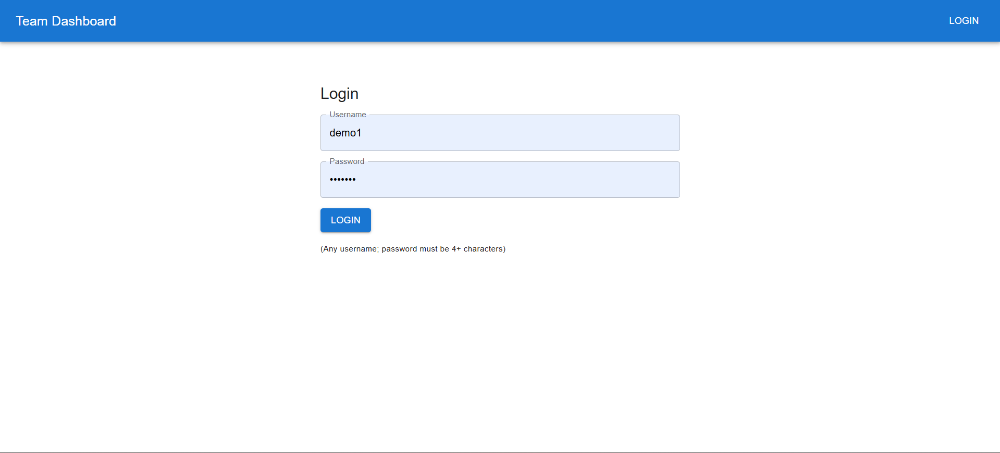
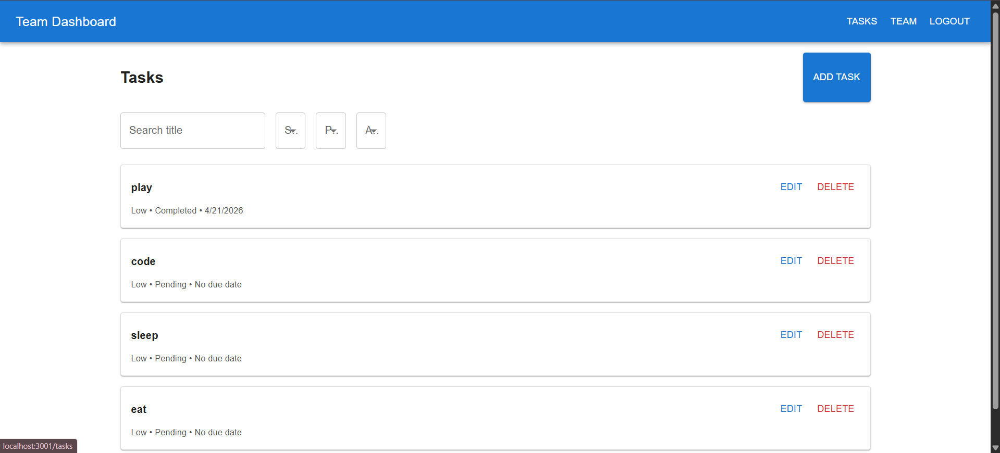
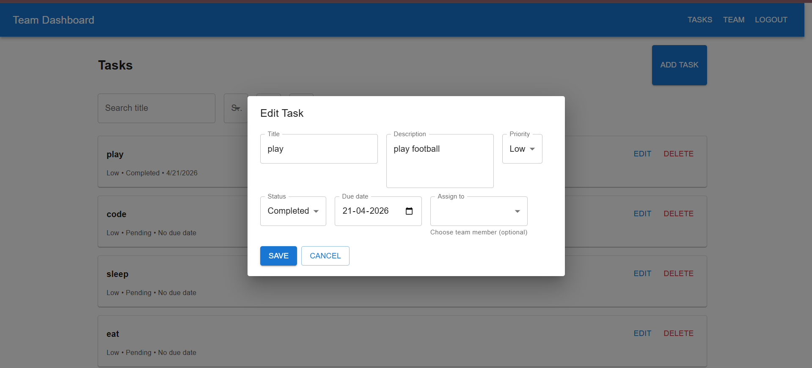
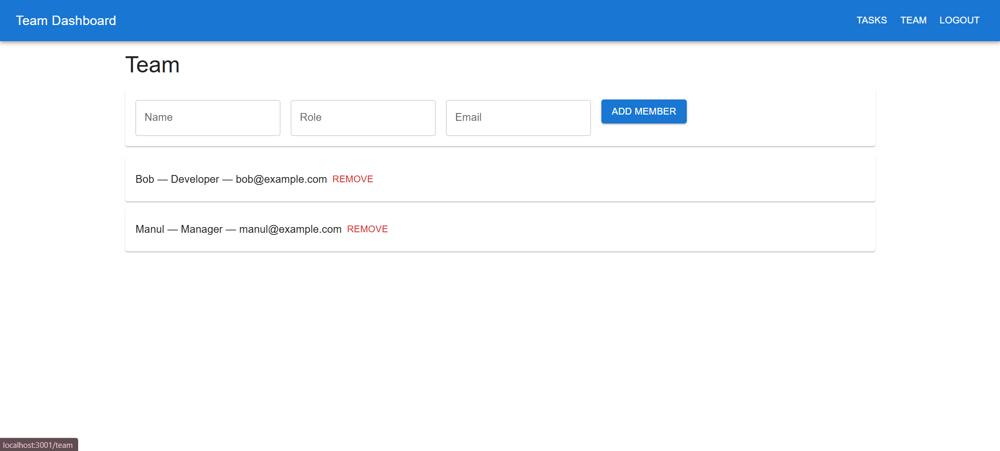

# PROJECT TITLE: Team Dashboard
## 📌 Project Description

A brief overview of what my project does. Example:

The Team Dashboard is a React-based task and team management application that allows users to manage tasks, track progress, and collaborate with team members. This project includes authentication, task CRUD operations, filters, search, comments, activity logs, and LocalStorage persistence.

## 🚀 Features

List all functionalities clearly:

🔐 Authentication

Login with username & password

Validations

LocalStorage session

Protected routes

📝 Task Management

Create new task

Edit task

Delete task

Assign team member

Set priority (Low/Medium/High)

Set due date

Change status (Pending, In-Progress, Completed)

Comments

Activity log

🔍 Task List Features

Search tasks

Filter by status

Filter by priority

Filter by assigned user

Pagination (Next/Prev)

📊 Dashboard

Total tasks

Completed tasks

Pending tasks

Overdue tasks

👥 Team Management

Add team member

Remove team member

View list of team members

💾 Storage

All data saved in LocalStorage

No backend required

## 📁 Folder Structure

PROJECT_ROOT/
 ├── public/ 
 
 ├── src/
 
 │   ├── api/
 
 │   ├── components/
 
 │   │   ├── Navbar.jsx
 
 │   │   ├── PrivateRoute.jsx
 
 │   │   └── TaskForm.jsx
 
 │   ├── contexts/
 
 │   │   ├── AuthContext.jsx
 
 │   │   ├── TaskContext.jsx
 
 │   │   └── TeamContext.jsx
 
 │   ├── pages/
 
 │   │   ├── LoginPage.jsx
 
 │   │   ├── DashboardPage.jsx
 
 │   │   ├── TaskListPage.jsx
 
 │   │   ├── TaskDetailsPage.jsx
 
 │   │   └── TeamPage.jsx
 
 │   ├── App.js
 
 │   ├── index.js
 
 │   └── index.css
 
 ├── package.json
 
 └── README.md
 

## Screenshots

### Login Page

### Task List

### Task Details

### Team Page

## ⚙️ Setup Steps (Run Locally)
1️⃣ Clone the repository
git clone https://github.com/YOUR_USERNAME/team-dashboard.git

2️⃣ Go inside project folder
cd team-dashboard

3️⃣ Install dependencies
npm install

4️⃣ Start the development server
npm start

5️⃣ Open the app
http://localhost:3000
=======
# team-dashboard
A Task &amp; Team Management dashboard built using React, Context API, React Router, and Material UI. The application includes user authentication, task CRUD operations, team management, activity logs, comments, filtering, search, and pagination — all saved in LocalStorage.
